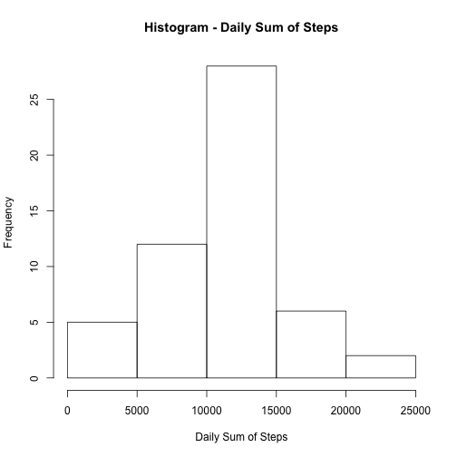
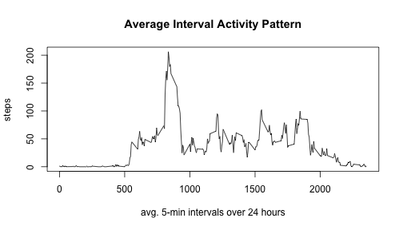
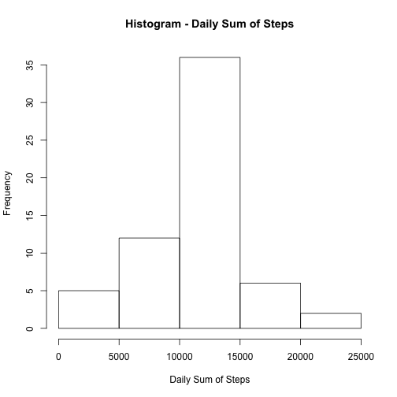
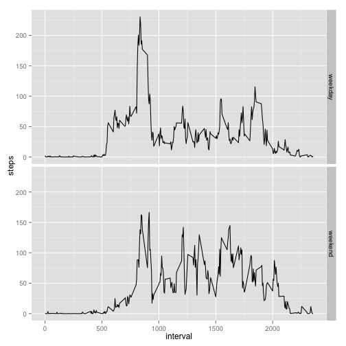

---
Reproducible Research Peer Assessment 1
=======================================

```r
output:
  html_document:
  keep_md: true
```

```
## Error in eval(expr, envir, enclos): object 'output' not found
```

```r
  self_contained: no
```

```
## Error in eval(expr, envir, enclos): object 'self_contained' not found
```

First, we unzip the data file in the Github repository:


```r
unzip("activity.zip")
```

Read the file and format date:

```r
ActiveData <- read.csv("activity.csv")
library(lubridate)
ActiveData$date <- ymd(ActiveData$date)
```
Calculate the total number of steps taken per day

```r
library(dplyr)
```

```
## 
## Attaching package: 'dplyr'
## 
## The following objects are masked from 'package:lubridate':
## 
##     intersect, setdiff, union
## 
## The following object is masked from 'package:stats':
## 
##     filter
## 
## The following objects are masked from 'package:base':
## 
##     intersect, setdiff, setequal, union
```

```r
ActiveDays <- group_by(ActiveData, date)
Sums <- summarise(ActiveDays, steps=sum(steps))
```
Create a histogram of results:

```r
hist(Sums$steps, main = "Histogram - Daily Sum of Steps", xlab = "Daily Sum of Steps")
```

 
  
Calculate and report the mean and median of the total number of steps taken per day

```r
MeanSteps <- mean(Sums$steps, na.rm = TRUE)
MeanSteps <- round(MeanSteps, digits = 0)
MedianSteps <- median(Sums$steps, na.rm = TRUE)
MedianSteps <- round(MedianSteps, digits = 0)
options(scipen=999)
```
The mean number of steps per day is 10766. The median is 10765.

Make a time series plot of the average daily activity pattern:  


```r
library(dplyr)
Intervals <- group_by(ActiveData, interval)
AvgInterval <- summarize(Intervals, steps=mean(steps, na.rm=TRUE))
with(AvgInterval, plot(interval, steps, type = "l", main = "Average Interval Activity Pattern",xlab = "avg. 5-min intervals over 24 hours"))
```

 


```r
max <- which.max(AvgInterval$steps)
MaxInt <- AvgInterval[max, 1]
```
The 5-minute interval, on average across all the days in the dataset,  that contains the maximum number of steps is 835.


```r
SumNA <- sum(is.na(ActiveData$steps))
```

Total number of rows with NAs is 2304.

Fill in all of the missing values in the dataset:  


```r
## Using Average data by 5-min interval previously calculated, replace NAs with the Average for that interval.

names(AvgInterval) <- c("interval", "impute")

##make Average Data the same length as the Activity Data

ImputeAvg <- do.call("rbind", replicate(61, AvgInterval, simplify = FALSE))

## Convert to Data Frames and replace NAs with imputed data
df.ActiveData <- data.frame(ActiveData)
df.ImputeAvg <- data.frame(ImputeAvg)
df.ActiveData$steps[is.na(df.ActiveData$steps)] <- df.ImputeAvg$impute[is.na(df.ActiveData$steps)]
```
  
Calculate the total number of steps taken per day


```r
ActiveDays <- group_by(df.ActiveData, date)
Sums <- summarise(ActiveDays, steps=sum(steps))
```

Create a histogram of results:  


```r
hist(Sums$steps, main = "Histogram - Daily Sum of Steps", xlab = "Daily Sum of Steps")
```

 
  
Calculate and report the mean and median of the total number of steps taken per day  


```r
MeanSteps <- mean(Sums$steps, na.rm = TRUE)
MedianSteps <- median(Sums$steps, na.rm = TRUE)
MeanSteps <- round(MeanSteps, digits = 0)
MedianSteps <- round(MedianSteps, digits = 0)
options(scipen=999)
```
  
The mean number of steps per day is 10766. The median is 10766.  

Create a new factor variable in the dataset with two levels – “weekday” and “weekend” indicating whether a given date is a weekday or weekend day.

```r
df.ActiveData <- within(df.ActiveData, weekday <- weekdays(date))
df.ActiveData$weekend = df.ActiveData$weekday %in% c("Saturday", "Sunday")
df.ActiveData$weekend <- ifelse(df.ActiveData$weekend == "TRUE", "weekend", "weekday")
```
Make a panel plot containing a time series plot (i.e. type = "l") of the 5-minute interval (x-axis) and the average number of steps taken, averaged across all weekday days or weekend days (y-axis).  


```r
library(ggplot2)
WeekInterval <- group_by(df.ActiveData, interval, weekend)
AvgInterval <- summarize(WeekInterval, steps=mean(steps, na.rm=TRUE))
g <- ggplot(AvgInterval, aes(interval, steps))
g + geom_line() + facet_grid(weekend ~ .)
```

 

